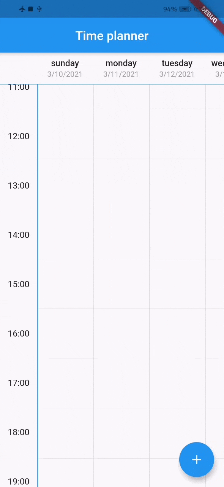
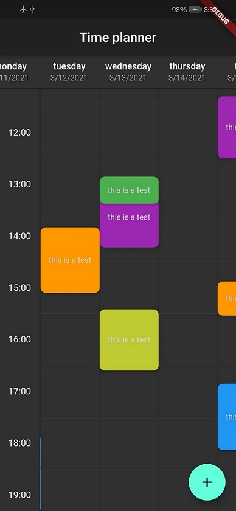
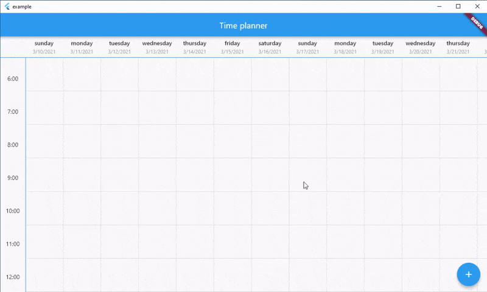
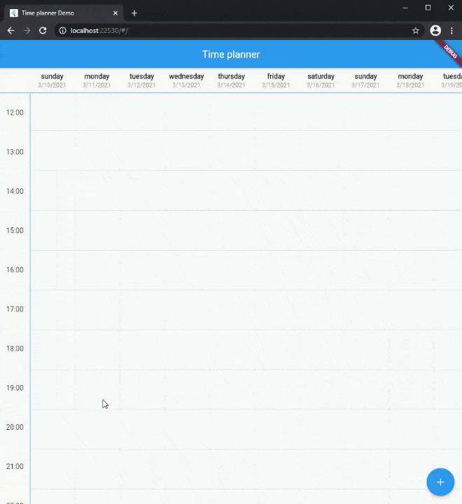
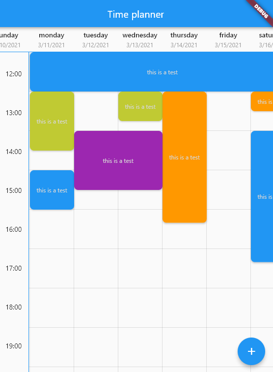

# Time planner

<a href="https://pub.dev/packages/time_planner">
      
</a>
<a href="https://github.com/Solido/awesome-flutter">
      
</a>

A beautiful, easy to use and customizable time planner for flutter mobile 📱, desktop 🖥 and web 🌐

This is a widget for show tasks to user on a time table.  
Each row show an hour and each column show a day but you can change the title of column and show any things else you want.

## Screenshots

| Mobile                           | Dark                               |
| -------------------------------- | ---------------------------------- |
|  |  |

| Desktop                            | Web                        |
| ---------------------------------- | -------------------------- |
|  |  |

## Demo

You can see web demo here: [https://jamalianpour.github.io/time_planner_demo](https://jamalianpour.github.io/time_planner_demo)

## Usage

##### 1. add dependencies into you project pubspec.yaml file

```yaml
dependencies:
  time_planner: ^0.0.3
```

##### 2. import time planner lib

```dart
import 'package:time_planner/time_planner.dart';
```

##### 3. use time planner

```dart
List<TimePlannerTask> tasks = [
  TimePlannerTask(
    // background color for task
    color: Colors.purple,
    // day: Index of header, hour: Task will be begin at this hour
    // minutes: Task will be begin at this minutes
    dateTime: TimePlannerDateTime(day: 0, hour: 14, minutes: 30),
    // Minutes duration of task
    minutesDuration: 90,
    // Days duration of task (use for multi days task)
    daysDuration: 1,
    onTap: () {},
    child: Text(
      'this is a task',
      style: TextStyle(color: Colors.grey[350], fontSize: 12),
    ),
  ),
];
```

```dart
TimePlanner(
  // time will be start at this hour on table
  startHour: 6,
  // time will be end at this hour on table
  endHour: 24,
  // each header is a column and a day
  headers: [
    TimePlannerTitle(
      date: "3/10/2021",
      title: "sunday",
    ),
    TimePlannerTitle(
      date: "3/11/2021",
      title: "monday",
    ),
    TimePlannerTitle(
      date: "3/12/2021",
      title: "tuesday",
    ),
  ],
  // List of task will be show on the time planner
  tasks: tasks,
),
```
#### Multi days task
You can add multi days task with `daysDuration` minimum and default value for this argument is 1 and result look like this :



### Style

you can change style of time planner with `TimePlannerStyle` :

```dart
style: TimePlannerStyle(
  backgroundColor: Colors.blueGrey[900],
  // default value for height is 80
  cellHeight: 60,
  // default value for width is 90
  cellWidth: 60,
  dividerColor: Colors.white,
  showScrollBar: true,
),
```

when time planner widget loaded it will be scroll to current local hour and this futrue is true by default, you can turn this off like this:

```dart
currentTimeAnimation: false,
```

---

Fill free to fork this repository and send pull request 🏁👍

[Medium post](https://yaus.ir/4n7MeZ)